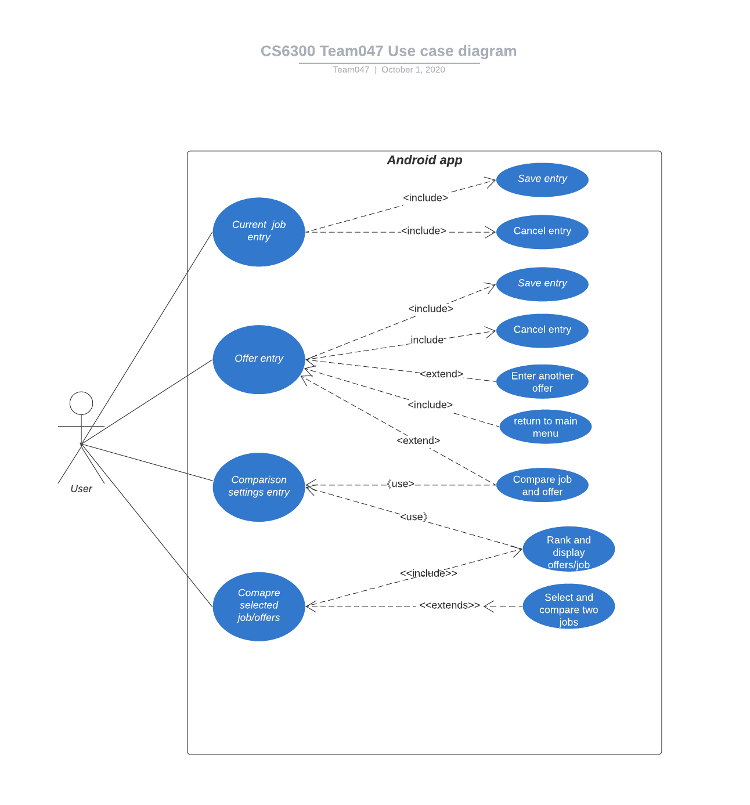

# Use Case Model

**Author**: Team047

## 1 Use Case Diagram

## 2 Use Case Descriptions

### Current Job Entry

- Requirements 
  - Allow user to add job details.
- Pre-conditions
  - User is in job entry page.
- Post-conditions
  - Job details are saved to database
- Scenarios:
  - Normal
    - User enters job details
    - User chooses to save job, and job details are saved to database. 
  - Alternate
    - User chooses to cancel, then UI goes back to main UI without doing anything.	      

### Offer Entry

- Requirements
  - Allow user to add offer details.
- Pre-conditions
  - User is in offer entry page.
- Post-conditions
  - Offer details are added to database. 
  - User returns to main page without saving.
- Scenarios:
   1. User enters offer details.
   2. User chooses to save offer, and offer is saved to database.
   3. User chooses to canel, then UI goes back to main UI without doing anything.

### Compare Job and Offer

- Requirements
  - Allow user to comapre to job after entering an offer.
- Pre-conditions
  - User enters one offer and job detail is present.
- Post-conditions
  - A comparison between job and offer is displayed to user.
- Scenarios:
   1. User enters offer information.
   2. User chooses to compare with job.
   3. Job and comparison settings are pulled from database.
   3. Job and offer are compared.

Comparison Settings Entry

Compare Selected Job/Offers

- *Requirements: High-level description of what the use case must allow the user to do.*
- *Pre-conditions: Conditions that must be true before the use case is run.*
- *Post-conditions Conditions that must be true once the use case is run.*
- *Scenarios: Sequence of events that characterize the use case. This part may include multiple scenarios, for normal, alternate, and exceptional event sequences. These scenarios may be expressed as a list of steps in natural language or as sequence diagrams.*